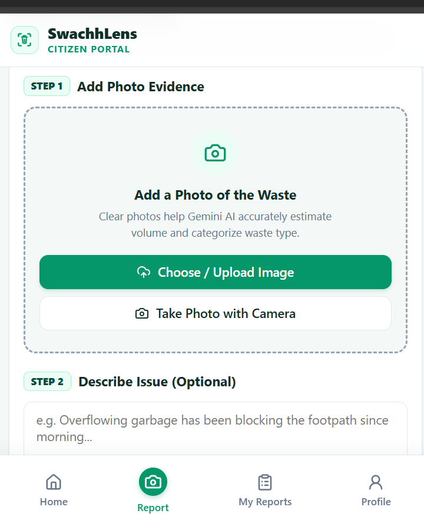
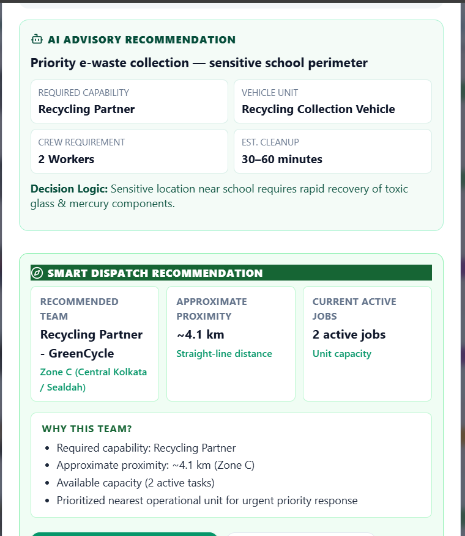
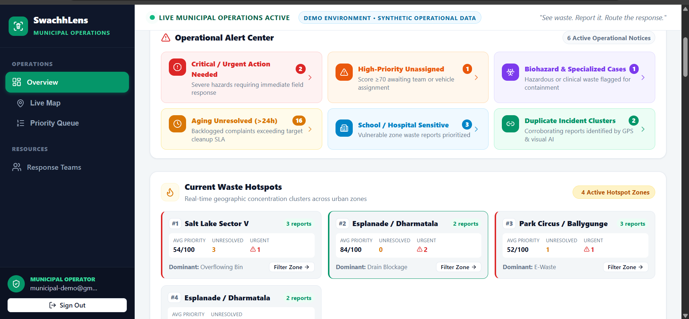
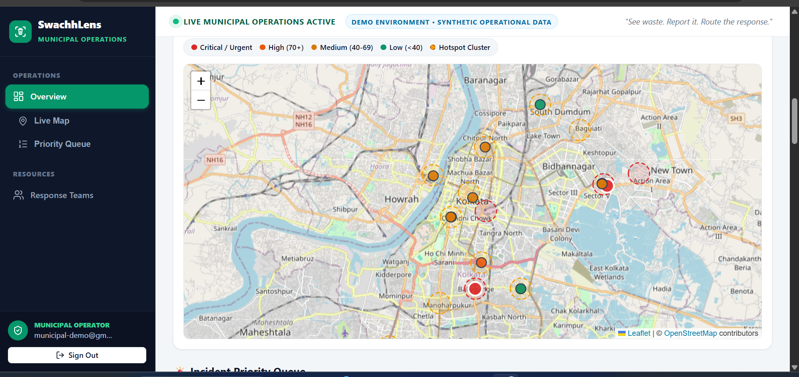
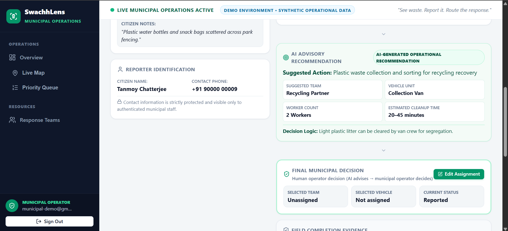
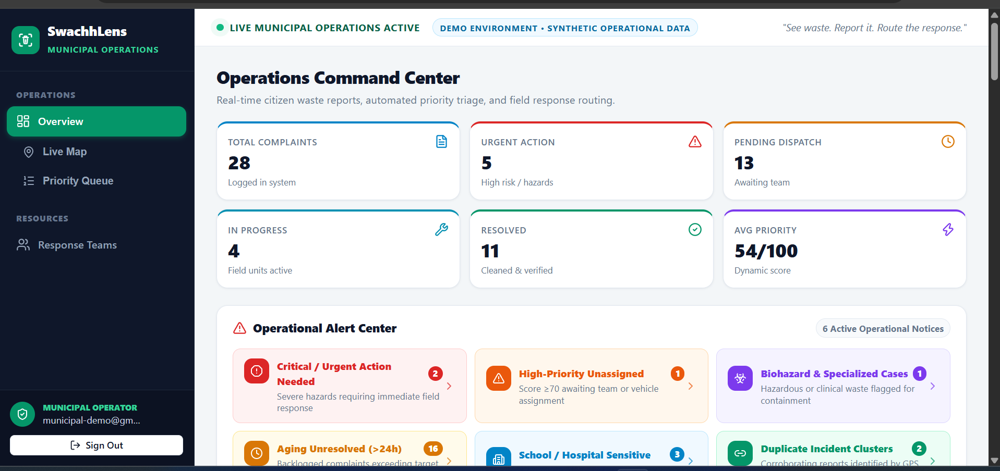
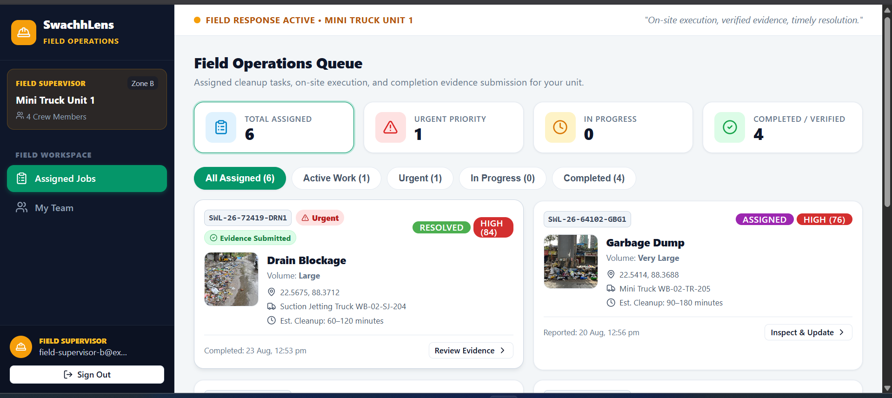
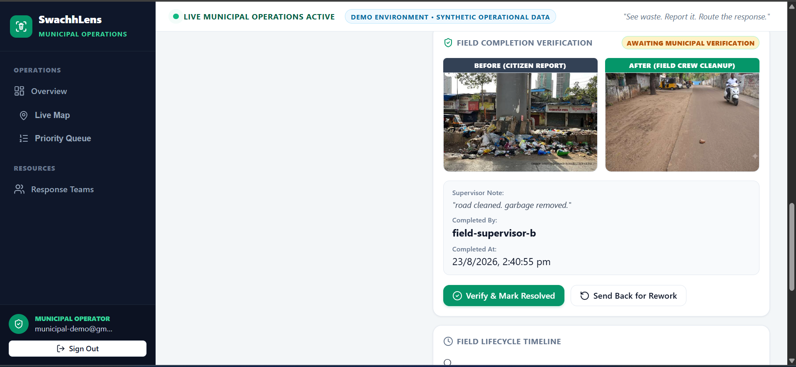
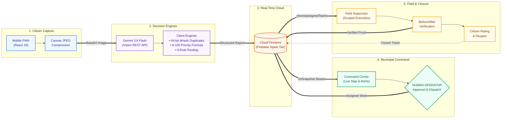

# SwachhLens 🔍

[](https://react.dev/)
[](https://vitejs.dev/)
[](https://firebase.google.com/)
[](https://ai.google.dev/)
[](https://leafletjs.com/)
[](LICENSE)

### AI-Powered Waste Response Decision Support System

> **TechNova: Igniting Brilliance (Season 3)** — Problem Statement 2: *Waste Management & Automated Response Routing*<br/>
> **Team TechTitans** — Guru Nanak Institute of Technology (GNIT), Kolkata<br/>
> *Md Farhan (Team Leader) • Ayush Kumar Chaudhary • Junaid Alam*

---

> **"SwachhLens transforms a citizen waste report into an explainable, geographically aware municipal response — from AI analysis and prioritization to field execution, verification, and citizen feedback."**

---

## 🎬 Demo

Prototype demo submitted through TechNova/Unstop.

---

## 💡 Problem

Urban solid waste management in Indian municipalities is predominantly **reactive and opaque**:
1. **Unidentified Waste Types & Volumes:** Citizens report waste without standardized classification, leaving control rooms unsure whether manual sweepers or heavy jetting vehicles are required.
2. **Redundant Dispatches:** Multiple citizens report the same overflowing bin or dump within hours, resulting in duplicate work orders.
3. **Hidden Biohazards:** Clinical, biomedical, and hazardous materials often sit unflagged in general queues without urgent escalation.
4. **Substandard Execution:** Supervisors often mark tasks "completed" without verifiable proof, leaving citizens dissatisfied.

---

## 🚀 Solution

SwachhLens bridges civic reporting and municipal operations through a **transparent, two-application ecosystem** built on Firebase's free (Spark) tier with **strict Human-in-the-Loop (HITL) governance**:

$$\text{Citizen Report} \longrightarrow \text{Gemini 3.6 Flash} \longrightarrow \text{Explainable Priority} \longrightarrow \text{Municipal Dispatch} \longrightarrow \text{Field Execution} \longrightarrow \text{Citizen Review}$$

```
┌────────────────────────────────────────────────────────────────────────────────────────┐
│                        CORE HUMAN-IN-THE-LOOP GOVERNANCE MANDATE                       │
│                                                                                        │
│   AI RECOMMENDS ──▶ MUNICIPAL OPERATOR DECIDES ──▶ FIELD SUPERVISOR EXECUTES           │
│                            │                                   │                       │
│                            ▼                                   ▼                       │
│                    CITIZEN REVIEWS ◀────────────── MUNICIPAL OPERATOR VERIFIES         │
│                   (1–5 Stars / Reopen)             (Before/After Photo Proof)          │
└────────────────────────────────────────────────────────────────────────────────────────┘
```

* **AI Advises, Humans Decide:** Gemini 3.6 Flash classifies waste and recommends equipment, but **human municipal officers retain sole authority** to assign crews, inspect before/after photos, and close tickets.

---

## ✨ Key Features

### 📱 Citizen Application (`citizen-app/`)
* **Flexible Access:** 1-click Anonymous Guest reporting or Email/Password registered accounts with persistent report history across signed-in sessions/devices.
* **Smart Client-Side Compression:** Canvas downscaling ($\\le 800\\text{px}$ JPEG, $\\sim 40–80\\text{ KB}$) saves bandwidth and enables zero-cost in-document storage.
* **Gemini 3.6 Flash Vision:** Instant classification across 8 waste types, 4 volume tiers, and clinical biohazard detection.
* **Explainable Priority Explainer:** Clear 0–100 score badge with transparent justification bullets.
* **Multi-Factor Duplicate Notice:** Alerts citizens if an active report already exists within 50m in the last 48 hours.
* **5-Stage Lifecycle Timeline:** Real-time tracking from `Reported` $\\rightarrow$ `Verified` $\\rightarrow$ `Assigned` $\\rightarrow$ `In Progress` $\\rightarrow$ `Resolved`.
* **Citizen Resolution Review:** 1–5 star rating, satisfaction comments, and 1-click Reopen Request if cleanup is incomplete.

### 🏢 Municipal Command Center (`portal/`)
* **Real-Time Operations Dashboard:** Live Firestore listener updates KPI cards and queues without manual page reloads.
* **Interactive Leaflet Live Map:** Color-coded priority pins (Red $\\ge 70$, Orange $40–69$, Green $<40$) and 800m hotspot overlays.
* **Real-Time Operational Alerts:** 6 auto-updating notice cards for critical incidents, biohazards, aging jobs ($>24\\text{h}$), and schools/hospitals.
* **Smart Dispatch Engine:** Recommends suitable response units based on capability matching and current team workload, with manual override.
* **Photographic Verification Dossier:** Side-by-side comparison of the citizen's Before photo vs supervisor's After photo.

### 👷 Field Supervisor Workspace (`portal/src/pages/Supervisor*`)
* **Team-Scoped Queue:** Supervisors authenticate and access only jobs assigned to their specific unit (`user.teamId`).
* **Cross-Team Access Guard:** Deep-linking to other units' jobs is blocked with an Access Denied banner.
* **Execution State Machine:** Step 1 (Mark Arrived) $\\rightarrow$ Step 2 (Start Work) $\\rightarrow$ Step 3 (Submit Completion Photo & Notes).
* **Rework Notification Banner:** Incomplete jobs returned by municipal officers immediately appear with rework instructions.

---

## ⚙️ How It Works

1. **Citizen Capture:** Citizen snaps a waste photo and captures GPS coordinates via the mobile PWA.
2. **Client Preprocessing:** Client-side HTML5 canvas compresses the photo to Base64 JPEG and generates a 64-bit perceptual dHash.
3. **Multimodal AI Analysis:** Google Gemini 3.6 Flash classifies waste category, estimates volume tier, and checks bio-waste risk.
4. **Decision Intelligence:** Deterministic engines calculate the 0–100 Priority Score and evaluate duplicate reports within 50m/48h.
5. **Action Recommendation:** Rule-based routing engine suggests response team type, vehicle, crew count, and estimated time.
6. **Municipal Review & Dispatch:** Municipal operator verifies incident on command center, reviews AI advisory, and assigns a team.
7. **Field Response:** Scoped field supervisor receives task, logs on-site arrival, and transitions job to In Progress.
8. **Evidence Submission:** Supervisor uploads post-cleanup photo and completion notes (`completed_pending_verification`).
9. **Municipal Verification:** Municipal officer inspects Before vs After photos side-by-side and approves resolution (`resolved`).
10. **Citizen Closure & Feedback:** Citizen views verified photos on their timeline, rates 1–5 stars, or requests reopening.

---

## 📸 Screenshots

| 1. Citizen Mobile Reporting & AI Analysis | 2. Explainable Priority & AI Recommendation |
|:---:|:---:|
|  |  |
| *Camera capture, client compression, GPS capture, and Gemini 3.6 Flash perception.* | *0–100 transparent score breakdown with 9-rule equipment recommendation.* |

| 3. Municipal Operations Command Center | 4. Live GIS Map & Hotspot Clusters |
|:---:|:---:|
|  |  |
| *Real-time KPI cards, priority queue, and active team workload tracker.* | *Interactive Leaflet map with priority pins and 800m spatial density clusters.* |

| 5. Smart Dispatch & Human Override | 6. Operational Alert Center |
|:---:|:---:|
|  |  |
| *AI suggested vehicle & crew vs active team capacity (`currentLoad`).* | *6 real-time cards highlighting bio-risks, unassigned high-priority, and aging jobs.* |

| 7. Field Supervisor Scoped Workspace | 8. Before/After Verification Dossier |
|:---:|:---:|
|  |  |
| *Mobile queue filtered to `user.teamId` with 3-step progress state machine.* | *Side-by-side photo inspection with 1-click Verify or Send Back for Rework.* |

---

## 🏗️ Architecture

Current prototype architecture: Firebase Spark / no-cost architecture, executing compute, AI perception, and scoring on client devices without requiring paid serverless infrastructure:



> 📄 **Architecture & Technical Documentation in Repository:**<br/>
> * **Technical Documentation PDF:** [`docs/SwachhLens_Technical_Documentation.pdf`](docs/SwachhLens_Technical_Documentation.pdf)<br/>
> * **Architecture & Data Flow PDF:** [`docs/SwachhLens_Architecture_DataFlow.pdf`](docs/SwachhLens_Architecture_DataFlow.pdf)<br/>
> * **Architecture & Data Flow Word Doc:** [`docs/SwachhLens_Architecture_and_DataFlow.docx`](docs/SwachhLens_Architecture_and_DataFlow.docx)<br/>
> * **System Architecture Diagrams:** [`docs/SwachhLens_Architecture.png`](docs/SwachhLens_Architecture.png) • [`docs/SwachhLens_Architecture_Simplified.png`](docs/SwachhLens_Architecture_Simplified.png)

---

## 🛠️ Technology Stack

| Technology | Purpose in SwachhLens |
|---|---|
| **React 19** | Declarative component UI for Citizen PWA and Municipal Command Center |
| **Vite 6** | Fast development server and optimized ESM production bundling |
| **React Router 7** | Client-side routing and role-scoped navigation guards |
| **Google Cloud Firestore** | Real-time document database with WebSocket synchronization and security rules |
| **Firebase Authentication** | Anonymous guest tokens and Email/Password staff RBAC |
| **Google Gemini 3.6 Flash** | Multimodal image classification, volume estimation, and biohazard detection |
| **Leaflet & React-Leaflet** | Interactive geospatial mapping with priority pins and hotspot overlays |
| **OpenStreetMap / CartoDB** | Open raster basemap tile layers |
| **Lucide React** | Consistent UI iconography |
| **HTML5 Canvas API** | In-browser image compression and 64-bit dHash computation |

---

## 🧠 Decision Intelligence

### 1. Explainable Priority Scoring (0–100)

```text
Priority Score =
  min(100, round(
    Volume × 40
  + Location × 30
  + Frequency × 20
  + Age × 10
  + Bio Risk Boost
  ))
```

* **Volume ($V \times 40$):** `small` ($0.25$), `medium` ($0.50$), `large` ($0.75$), `very_large` ($1.00$).
* **Location Sensitivity ($L \times 30$):** `blocking_drainage` ($1.00$), `near_school/hospital/waterbody` ($0.70$), `main_road` ($0.50$), `none` ($0.00$).
* **Report Frequency ($F \times 20$):** Reports within 50m in past 7 days: $\\frac{\\min(\\text{nearbyCount}, 5)}{5} \\times 20$.
* **Age of Complaint ($A \times 10$):** Elapsed hours: $\\min\\left(\\frac{\\text{hours}}{48}, 1.0\\right) \\times 10$.
* **Bio-Risk Escalation:** $+15\\text{ points}$ boost if `aiResult.bioWasteRisk === true`.

### 2. Multi-Factor Duplicate Detection
A new report is corroborated and linked (never silently discarded) when:
* Matches the same waste category (`aiResult.wasteType`).
* Located within **$\\le 50\\text{ meters}$** (Haversine distance).
* Submitted within the last **$48\\text{ hours}$**.
* **64-bit dHash Similarity:** Hamming distance match $\\ge 85\\%$ ($>80\\%$ high match, $65–79\\%$ moderate match).

### 3. Spatial Density Hotspot Clustering
* Iterative centroid clustering groups active complaints within an **$800\\text{m}$ radius**.
* Severity ranking formula: $(\\text{unresolved} \\times 20) + (\\text{urgent} \\times 30) + (\\text{avgPriority} \\times 0.5) + (\\text{count} \\times 5)$.
* *Note: Deterministic current-state density clustering, not predictive time-series forecasting.*

### 4. Rule-Based Intervention Recommendation
* 9 deterministic operational rules map waste type, volume, and location sensitivity to recommended team types (`manual_cleanup`, `mini_truck`, `recycling_partner`), vehicle requirements, crew sizes, and estimated response windows.

---

## 🔒 Security & Responsible AI

* **Document Immutability:** [`firestore.rules`](firestore.rules) protects core complaint fields (`citizenId`, `imageBase64`, `gps`, `timestamp`, `aiResult`, `priorityScore`, `isDuplicateOf`) against post-creation modification.
* **Citizen Feedback Diff Lock:** On resolved complaints, citizens can modify *only* the `feedback` map (`diff().affectedKeys().hasOnly(['feedback'])`).
* **Directory Write Lock:** The `municipalUsers` collection is locked (`allow write: if false;`), preventing role elevation.
* **Global Deletion Lock:** Document deletion is disabled (`allow delete: if false;`) across all collections.
* **Responsible AI:** AI recommendations are advisory; all dispatches, reworks, and closures require human municipal approval.

---

## 📂 Repository Structure

```
swachhlens/
├── citizen-app/             # Mobile-First Citizen Reporting Progressive Web App
│   ├── src/                 # Components, pages, services (Gemini, dHash, Priority)
│   └── vite.config.js       # Citizen app bundler configuration
│
├── portal/                  # Municipal Operations & Field Supervisor Command Center
│   ├── src/                 # Dashboard, Leaflet live map, Supervisor workspace
│   └── vite.config.js       # Portal bundler configuration
│
├── scripts/                 # Seeding and database verification scripts
│   ├── seed-demo-data.js    # Seeds realistic Kolkata demo complaints with valid photos
│   ├── seed-teams.js        # Seeds municipal response teams & capability profiles
│   └── verify-data.js       # Read-only database inventory audit tool
│
├── demo-assets/             # Illustrative demonstration waste images
├── docs/                    # Architecture & data-flow documentation (Word & PDF)
├── screenshots/             # High-resolution application screenshots
├── firestore.rules          # Firestore security and RBAC access rules
├── firestore.indexes.json   # Composite query indexes for Firestore
└── LICENSE                  # MIT Open-Source License
```

---

## 💻 Local Setup

### Prerequisites
* **Node.js:** v18.0.0+ (Tested on Node v20 & v24)
* **npm:** v9.0.0+
* **Google Gemini API Key:** [Google AI Studio](https://aistudio.google.com/)
* **Firebase Project:** Cloud Firestore & Firebase Auth enabled

### 1. Clone & Install Dependencies
```bash
git clone https://github.com/farhanmd03/swachhlens.git
cd swachhlens

# Install root dependencies
npm install

# Install citizen-app dependencies
cd citizen-app && npm install

# Install portal dependencies
cd ../portal && npm install
cd ..
```

### 2. Environment Configuration
Create `.env` files in both `citizen-app/` and `portal/` based on `.env.example`:

**`citizen-app/.env`:**
```env
VITE_GEMINI_API_KEY=your_gemini_api_key
VITE_FIREBASE_API_KEY=your_firebase_api_key
VITE_FIREBASE_AUTH_DOMAIN=your_project.firebaseapp.com
VITE_FIREBASE_PROJECT_ID=your_project_id
VITE_FIREBASE_MESSAGING_SENDER_ID=your_sender_id
VITE_FIREBASE_APP_ID=your_app_id
```

**`portal/.env`:**
```env
VITE_FIREBASE_API_KEY=your_firebase_api_key
VITE_FIREBASE_AUTH_DOMAIN=your_project.firebaseapp.com
VITE_FIREBASE_PROJECT_ID=your_project_id
VITE_FIREBASE_MESSAGING_SENDER_ID=your_sender_id
VITE_FIREBASE_APP_ID=your_app_id
```

### 3. Seed Demo Data (Optional)
> The repository includes the demo waste images required by the seeding scripts under `demo-assets/`, so no separate image download is required for the included demo dataset.

```bash
# Populate response teams and realistic Kolkata waste incidents
node scripts/seed-teams.js
node scripts/seed-demo-data.js
```

### 4. Run Applications
```bash
# Terminal 1: Launch Citizen Reporting App (Port 5173)
cd citizen-app
npm run dev

# Terminal 2: Launch Municipal Command Center (Port 5174)
cd portal
npm run dev
```
* **Citizen App:** `http://localhost:5173`
* **Municipal Portal:** `http://localhost:5174`

---

## 🔍 Current Prototype Limitations

* **Photo-Based:** Operates on single-image captures; video stream ingestion is not supported in this prototype.
* **Spark Tier Optimization:** Stores compressed Base64 strings directly in Firestore documents to run within Firebase free tier limits.
* **Current-State Hotspots:** Groups active reports by spatial density; does not provide predictive machine learning forecasting.
* **Prototype Stage:** Evaluated using realistic seeded urban scenarios; not deployed with an active municipal corporation.

---

## 🔮 Future Scope

* **Server-Side API Gateway:** Transition Gemini API execution to Google Cloud Functions (Gen 2) with Cloud Secret Manager.
* **Cloud Storage Buckets:** Store high-resolution media in Google Cloud Storage with automated thumbnail generation.
* **Citizen Push Alerts:** Integrate Firebase Cloud Messaging (FCM) and SMS gateways for real-time status notifications.
* **Longitudinal Analytics:** Ingest historical complaint records into Google BigQuery for seasonal illegal dumping trends.

---

## 👥 Team

**Team TechTitans**
* **Md Farhan** — Team Leader
* **Ayush Kumar Chaudhary**
* **Junaid Alam**

*Guru Nanak Institute of Technology (GNIT), Kolkata*

---

## 📄 License

This project is licensed under the **MIT License** — see the [LICENSE](LICENSE) file for details.
