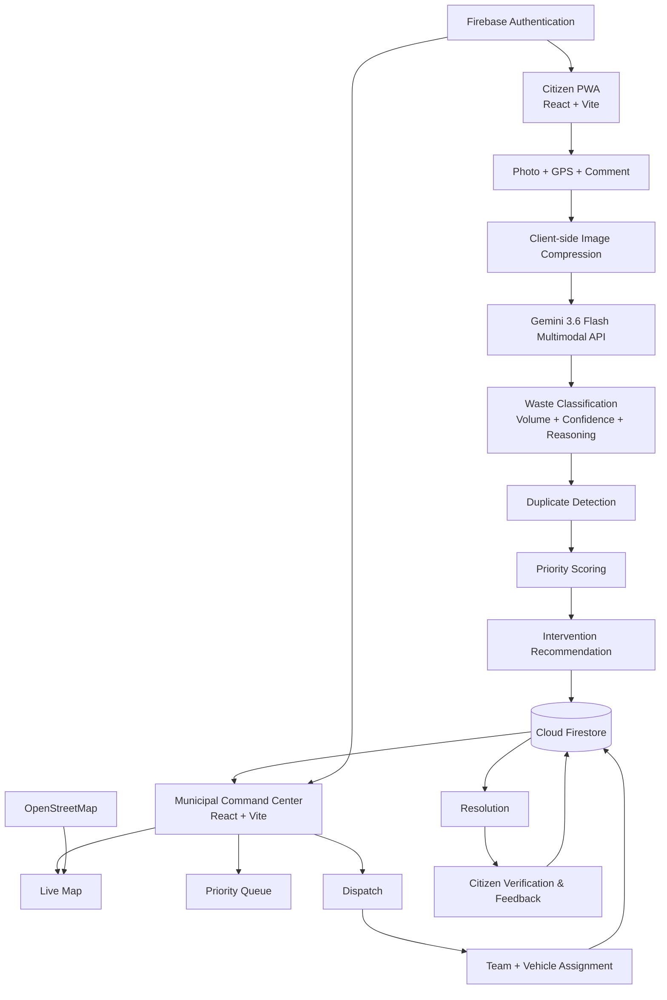

# SwachhLens 🔎


## AI-Powered Waste Response Decision Support System

**Built for TechNova: Igniting Brilliance (Season 3)**  
**Team TechTitans**  
**Guru Nanak Institute of Technology, Kolkata**  
**B.Tech Computer Science & Engineering — 3rd Year**  

### Team TechTitans

- **Md Farhan** — Team Leader
- **Ayush Kumar Chaudhary**
- **Junaid Alam**

---

## 🚮 Problem

Urban waste management is often reactive: citizens report an issue, officials inspect it, and only then decide what manpower, vehicle, or response team is required.

This creates delays and makes it difficult to answer:

- What type of waste is present?
- How much waste needs to be cleared?
- Is the complaint a duplicate?
- Which complaints need urgent escalation?
- Which team and vehicle should be dispatched?
- How should limited municipal resources be prioritized?

**SwachhLens** addresses this gap by converting a citizen's waste report into structured, AI-assisted operational intelligence.

---

## 💡 Solution

SwachhLens is a mobile-first citizen reporting application and municipal command center that transforms:

```text
Citizen Report
      ↓
Photo + GPS + Description
      ↓
Gemini Multimodal Analysis (Gemini 3.6 Flash)
      ↓
Waste Type + Volume + Confidence
      ↓
Duplicate Detection
      ↓
Explainable Priority Score
      ↓
Intervention Recommendation
      ↓
Municipal Decision
      ↓
Team + Vehicle Dispatch
      ↓
Resolution
      ↓
Citizen Verification & Feedback
```

The system is designed to help municipalities respond **faster, more transparently, and with better resource allocation**.

---

## ✨ Key Features

### Citizen Application

- 📸 Camera/file-based waste reporting
- 🗜️ Client-side image compression
- 📍 GPS-based location capture
- 📝 Optional incident description
- 🧠 Gemini 3.6 Flash-powered waste classification
- 📦 AI-assisted volume estimation
- 🎯 AI confidence and reasoning
- 🔍 Duplicate detection using category, time and GPS proximity
- 📊 Explainable priority scoring
- 🚚 Actionable intervention recommendation
- 🆔 Human-readable complaint tracking ID
- 📋 Complaint history and live status tracking
- 👤 Citizen profile
- ⭐ Resolution verification and feedback
- 📱 Mobile-first responsive interface

### Municipal Command Center

- 📊 Real-time operational dashboard
- 🗺️ Live complaint map using Leaflet + OpenStreetMap
- 🚨 Urgent complaint identification
- 📋 Sortable and filterable priority queue
- 🤖 AI advisory recommendation
- 👨‍💼 Human-in-the-loop municipal decision making
- 🚚 Team and vehicle dispatch
- 👥 Response team and dispatch management
- 🔄 Complaint lifecycle tracking
- ⭐ Citizen feedback visibility
- 🔎 Complaint search and filtering

---

## 🧠 AI & Decision-Support Pipeline

SwachhLens separates **AI perception** from **transparent operational logic**.

Gemini handles visual understanding, while priority calculation and intervention recommendations use transparent deterministic rules that municipal operators can inspect and override.

### Gemini 3.6 Flash

Gemini 3.6 Flash analyzes the submitted waste image and provides:

- Waste type
- Approximate volume
- Confidence score
- Location-sensitivity hint
- Visual reasoning

Supported waste categories:

- Overflowing Bin
- Garbage Dump
- Plastic Waste
- Construction Debris
- Organic Waste
- E-Waste
- Hazardous Waste
- Drain Blockage

### Intervention Recommendation

A transparent rule-based decision engine converts the AI result into an operational recommendation.

Examples:

```text
Large waste
→ Mini Truck + Additional Workers

Plastic / E-Waste
→ Recycling Partner

Drain Blockage
→ Urgent Drainage Response

Hazardous Waste
→ Urgent Specialized Response

Small Ordinary Waste
→ Manual Cleanup Team
```

The recommendation is **advisory**. Municipal staff can accept or override it.

---

## 🎬 Demo Scenario

1. Citizen creates a profile.
2. Citizen uploads a waste image and location.
3. Gemini 3.6 Flash classifies the waste and estimates volume.
4. SwachhLens calculates priority and recommends an intervention.
5. The complaint appears in the municipal command center.
6. The municipal operator accepts or overrides the AI recommendation.
7. A team and vehicle are assigned.
8. The complaint progresses to resolution.
9. The citizen verifies the resolution and submits feedback.

---

## 📊 Explainable Priority Scoring

SwachhLens uses a transparent weighted score:

```text
priorityScore =
    (volumeWeight × 40)
  + (locationSensitivity × 30)
  + (reportFrequency × 20)
  + (ageOfComplaint × 10)
```

### Volume Weight

| Volume | Weight |
| :--- | :--- |
| Small | 0.25 |
| Medium | 0.50 |
| Large | 0.75 |
| Very Large | 1.00 |

### Location Sensitivity

| Situation | Weight |
| :--- | :--- |
| None | 0.00 |
| Near School | 0.70 |
| Near Hospital | 0.70 |
| Near Water Body | 0.70 |
| Blocking Drainage | 1.00 |

### Report Frequency

Nearby reports within approximately 50 metres during the previous seven days are counted and normalized, with five or more reports reaching the maximum frequency contribution.

### Complaint Age

```text
hoursSinceReport / 48
```

capped at `1.0`.

The portal also displays **why a complaint received its priority score**, such as:

```text
• Large waste volume
• Near school
• 3 nearby reports
• Unresolved for 16 hours
```

This makes the decision process more transparent than a black-box severity number.

---

## 🔍 Duplicate Detection

Potential duplicates are identified using:

- Same waste category
- Unresolved existing complaint
- Submission within approximately 48 hours
- GPS distance ≤ 50 metres

Distance is calculated using the **Haversine formula**.

Duplicate complaints are flagged rather than automatically deleted.

---

## 🚨 Urgent Escalation

Urgent escalation is triggered for:

- Hazardous waste
- Drain blockage
- Reports near schools
- Reports near hospitals

These cases receive stronger visual emphasis and higher operational urgency.

---

## 🗺️ Live Complaint Map & Operations

The municipal portal provides an interactive Leaflet/OpenStreetMap map with priority-coded markers and urgent indicators — a live operational view of submitted complaints, not a predictive heatmap.

Markers are color-coded by priority:

| Score | Level |
| :--- | :--- |
| > 70 | High |
| 40–70 | Medium |
| < 40 | Low |

The portal supports:

- complaint search
- status filtering
- waste-type filtering
- urgent-only filtering
- duplicate-only filtering
- priority sorting
- complaint detail inspection
- dispatch operations

---

## 🚚 Human-in-the-Loop Dispatch

SwachhLens clearly separates:

### AI Recommendation

```text
Suggested Team
Vehicle
Worker Count
Estimated Cleanup Time
Reasoning
```

from:

### Final Municipal Decision

```text
Selected Team
Selected Vehicle
Worker Count
Final Status
```

The AI does not autonomously dispatch municipal resources.

The final decision remains with the authorized municipal operator.

---

## 🔄 Complaint Lifecycle

```text
Reported
   ↓
Verified
   ↓
Assigned
   ↓
In Progress
   ↓
Resolved
   ↓
Citizen Verification
   ↓
Feedback
```

Citizens can track their complaint and provide resolution feedback once the municipality marks the issue as resolved. Citizens can submit resolution feedback after municipal resolution and request reopening when an issue is not adequately resolved.

---

## 👤 Citizen Profile & Privacy

Citizens authenticate anonymously and create a lightweight profile with a required name and optional phone, email, area and ward fields, so that municipal operators can identify the reporter and provide complaint-related communication.

Citizen contact information is **not publicly displayed** on maps or feeds.

For this prototype, the anonymous profile is linked to the browser session. Clearing local browser data may result in loss of access to the anonymous account.

---

## 🗄️ Firestore Data Model

### `complaints/{complaintId}`

| Field | Type | Description |
| :--- | :--- | :--- |
| `complaintNumber` | string | Human-readable tracking ID |
| `citizenId` | string | Firebase Auth UID |
| `citizenName` | string | Reporter name |
| `citizenPhone` | string/null | Optional reporter phone |
| `imageBase64` | string | Compressed image |
| `gps.lat` | number | Latitude |
| `gps.lng` | number | Longitude |
| `timestamp` | number | Original report time |
| `comment` | string | Optional description |
| `aiResult` | object | Gemini analysis |
| `isDuplicateOf` | string/null | Existing complaint ID if duplicated |
| `priorityScore` | number | 0–100 priority score |
| `priorityReasons` | array | Human-readable score explanation |
| `recommendedIntervention` | object | Rule-based operational recommendation |
| `status` | string | Current lifecycle status |
| `assignedTeam` | string/null | Assigned team |
| `assignedVehicle` | string/null | Assigned vehicle |
| `urgentEscalation` | boolean | Urgent response flag |
| `verifiedAt` | number/null | Verification timestamp |
| `assignedAt` | number/null | Assignment timestamp |
| `inProgressAt` | number/null | Work-start timestamp |
| `resolvedAt` | number/null | Resolution timestamp |
| `feedback` | object/null | Citizen resolution feedback |
| `isDemo` | boolean | Indicates a fictional hackathon demo record |

### `citizens/{citizenId}`

Stores lightweight citizen profile data.

### `teams/{teamId}`

Stores response-team information such as team type, current workload and active status.

---

## 🏗️ Architecture



---

## ☁️ Firebase Spark Prototype Architecture

This prototype intentionally uses Firebase's **Spark no-cost plan**.

### Used

- Firebase Authentication
- Cloud Firestore
- Firebase Hosting

### Not Used

- Firebase Storage
- Cloud Functions
- Cloud Run
- Other billing-required backend services

Images are compressed client-side and stored as Base64 in Firestore to remain within the prototype architecture.

---

## ⚠️ Known Prototype Limitations

### 1. Client-side Gemini API key

The Gemini API key is intentionally used client-side for this prototype. The real key is stored only in local `.env` files and is never committed to the repository. For any public deployment, API restrictions (HTTP referrers) and usage quotas should also be configured in Google Cloud Console.

### 2. Client-side computed fields

AI inference, duplicate detection, priority calculation and intervention recommendation run client-side in this Spark-only prototype. Authentication and Firestore are managed by Firebase.

### 3. Base64 image storage

Production systems should use dedicated object storage rather than storing images directly inside Firestore documents.

### 4. Anonymous citizen identity

The prototype uses anonymous authentication; browser-data deletion can make an anonymous profile unrecoverable.

### 5. Prototype municipal authentication

The municipal portal uses Email/Password authentication. Production deployment should add stronger role-based access control.

### 6. Duplicate detection

The current prototype uses GPS/time/category-based duplicate detection. More advanced image-similarity detection is future work.

---

## 🔐 Data Ethics & Responsible AI

- Only limited personal information is collected.
- Citizen contact information is restricted to authenticated municipal workflows.
- GPS is captured for operational location purposes.
- Images are used for waste-analysis and complaint handling.
- AI results include confidence and reasoning.
- AI recommendations are advisory rather than autonomous decisions.
- Municipal operators retain final control over dispatch decisions.
- A production deployment should introduce explicit retention/deletion policies and stronger access controls.

---

## 🚀 Setup

### Prerequisites

- Node.js
- npm
- Firebase project
- Firebase Authentication
- Cloud Firestore
- Gemini API key from Google AI Studio

### 1. Clone

```bash
git clone <repository-url>
cd swachhlens
```

### 2. Install Dependencies

```bash
cd citizen-app
npm install

cd ../portal
npm install

cd ..
```

### 3. Configure Environment Variables

Copy `.env.example` to `.env` in both applications.

Citizen app requires:

```text
VITE_GEMINI_API_KEY
VITE_FIREBASE_API_KEY
VITE_FIREBASE_AUTH_DOMAIN
VITE_FIREBASE_PROJECT_ID
VITE_FIREBASE_MESSAGING_SENDER_ID
VITE_FIREBASE_APP_ID
```

Portal requires the Firebase variables only.

**Never commit `.env` files or API keys.** Double-check `.gitignore` includes `.env` before your final push.

### 4. Run Locally

Terminal 1:

```bash
cd citizen-app
npm run dev
```

Terminal 2:

```bash
cd portal
npm run dev
```

### 5. Demo Data

The repository contains scripts for:

- demo team seeding
- demo complaint seeding
- demo image repair

Demo complaints and associated images are fictional presentation data and are not real municipal records. If any demo images have attribution/license requirements, keep `demo-assets/SOURCES.md` in the repository.

---

## 🧪 Verification

Production builds:

```bash
cd citizen-app
npm run build

cd ../portal
npm run build
```

The expected end-to-end demo flow is:

```text
Citizen Profile
→ Waste Photo
→ GPS
→ Gemini Analysis
→ Priority
→ Intervention Recommendation
→ Submit
→ Municipal Dashboard
→ Dispatch
→ Resolution
→ Citizen Feedback
```

---

## 📸 Screenshots

> Screenshots to be added by the author.

Recommended screenshots:

- Citizen Home
- Citizen AI Analysis
- Complaint Tracking
- Municipal Dashboard
- Live Complaint Map
- Priority Queue
- AI Recommendation + Municipal Decision
- Resolution Feedback

---

## 🎬 Demo

The project is not currently deployed. It runs locally following the [Setup](#-setup) instructions above.

A demo video will be added here once recorded.

---

## 🔮 Future Scope

- Secure server-side Gemini inference
- Firebase Storage / object storage for images
- Image-similarity duplicate detection
- Video-based waste analysis
- Push/SMS/WhatsApp notifications
- Production-grade role-based access control
- Advanced hotspot and predictive analytics
- Automated before/after cleanup verification
- Integration with existing municipal complaint platforms

---

## 🛠️ Tech Stack

| Technology | Purpose |
| :--- | :--- |
| React | Frontend applications |
| Vite | Build tooling |
| Firebase Authentication | Citizen and municipal authentication |
| Cloud Firestore | Real-time data layer |
| Cloud Firestore | Real-time data layer |
| Google Gemini 3.6 Flash | Multimodal waste analysis |
| Leaflet | Interactive maps |
| OpenStreetMap | Map tiles |
| React Router | Client-side navigation |
| Lucide React | Interface icons |

---

## 📄 License

This project is licensed under the **MIT License** — see the [LICENSE](LICENSE) file for the full text.

---

## 👥 Team

**Team TechTitans**

- **Md Farhan** — Team Leader
- **Ayush Kumar Chaudhary**
- **Junaid Alam**

**Guru Nanak Institute of Technology, Kolkata**  
**B.Tech Computer Science & Engineering — 3rd Year**  

---

> **SwachhLens — See waste. Report it. Route the response.**
