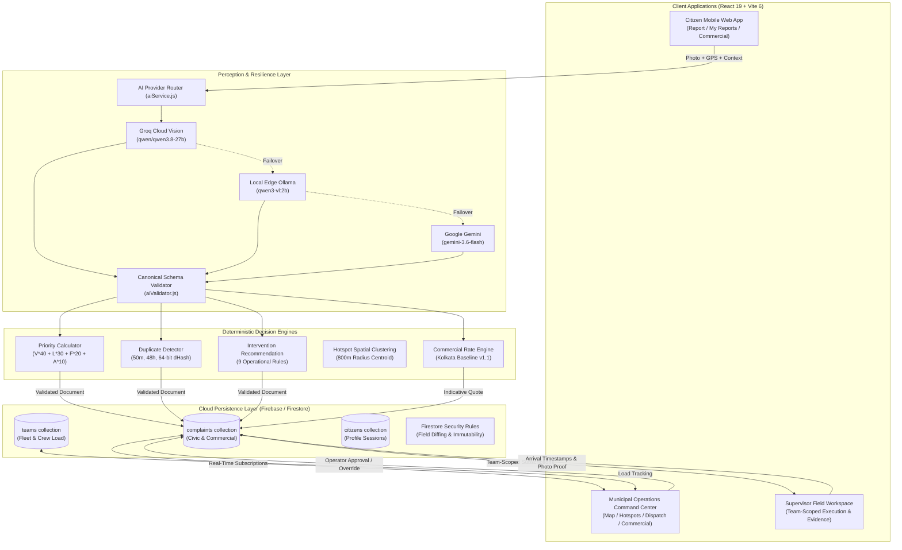

# SwachhLens 🔍

[](https://react.dev/)
[](https://vitejs.dev/)
[-FFCA28?logo=firebase&logoColor=black)](https://firebase.google.com/)
[](https://leafletjs.com/)
[](https://reactrouter.com/)
[](LICENSE)

### AI-Assisted Waste Response & Operations Platform
**One operational platform, two service channels: reactive civic waste response and planned commercial waste operations.**

> **National Finalist** • [TSM TECHNOVA 2026 National AI Innovation Challenge Grand Finale](https://tsm.ac.in/) (TSM, Madurai)<br/>
> **Team TechTitans** — Guru Nanak Institute of Technology (GNIT), Kolkata<br/>
> *Md Farhan (Team Leader) • Ayush Kumar Chaudhary • Junaid Alam*

---

> *"SwachhLens is not only a public complaint portal and not only a private waste-booking system. It is an operational decision-support and dispatch platform that converts visual observation and operational inputs into explainable priorities, coordinated field execution, verifiable physical proof, and planned waste workflows."*

---

## 📑 Table of Contents

- [1. Executive Summary & National Finale Context](#1-executive-summary--national-finale-context)
- [2. The Operational Problem in Urban Waste](#2-the-operational-problem-in-urban-waste)
- [3. Product Model: One Platform, Two Service Channels](#3-product-model-one-platform-two-service-channels)
  - [Channel A: Civic Waste Response](#channel-a-civic-waste-response)
  - [Channel B: Planned / Commercial Waste Services](#channel-b-planned--commercial-waste-services)
- [4. Target Stakeholders](#4-target-stakeholders)
- [5. Core Product & Decision Principles](#5-core-product--decision-principles)
- [6. Multi-Provider AI Architecture & Failover Resilience](#6-multi-provider-ai-architecture--failover-resilience)
- [7. Human-in-the-Loop Governance & Responsible AI](#7-human-in-the-loop-governance--responsible-ai)
- [8. Deterministic Decision & Recommendation Engines](#8-deterministic-decision--recommendation-engines)
  - [A. Priority Scoring Engine](#a-priority-scoring-engine)
  - [B. Urgency & Escalation Rules](#b-urgency--escalation-rules)
  - [C. Intervention Recommendation Engine](#c-intervention-recommendation-engine)
  - [D. Duplicate Detection & Perceptual Hashing](#d-duplicate-detection--perceptual-hashing)
  - [E. Spatial Hotspot Clustering](#e-spatial-hotspot-clustering)
  - [F. Dispatch Recommendation & Fleet Matching](#f-dispatch-recommendation--fleet-matching)
  - [G. Commercial Assessment Engine](#g-commercial-assessment-engine)
  - [H. Transparent Commercial Rate Card & Quote Engine](#h-transparent-commercial-rate-card--quote-engine)
- [9. End-to-End Operational Lifecycles](#9-end-to-end-operational-lifecycles)
  - [Civic Incident Lifecycle](#civic-incident-lifecycle)
  - [Commercial Service Lifecycle & Price Lock](#commercial-service-lifecycle--price-lock)
- [10. Municipal Operations Command Center](#10-municipal-operations-command-center)
- [11. Field Supervisor Workspace](#11-field-supervisor-workspace)
- [12. Evidence Verification & Citizen Feedback Loop](#12-evidence-verification--citizen-feedback-loop)
- [13. Kolkata-Focused Commercial Prototype Model](#13-kolkata-focused-commercial-prototype-model)
- [14. Empirical Validation Evidence (10-Image Benchmark)](#14-empirical-validation-evidence-10-image-benchmark)
- [15. System Architecture & Data Flow](#15-system-architecture--data-flow)
- [16. Verified Technology Stack](#16-verified-technology-stack)
- [17. Cloud Firestore Data Model & Security Rules](#17-cloud-firestore-data-model--security-rules)
- [18. Security, Privacy & Role Governance](#18-security-privacy--role-governance)
- [19. Visual Walkthrough & Verified Screenshots](#19-visual-walkthrough--verified-screenshots)
- [20. Repository Directory Structure](#20-repository-directory-structure)
- [21. Local Setup & Execution Guide](#21-local-setup--execution-guide)
- [22. Known Prototype Limitations](#22-known-prototype-limitations)
- [23. Future Development Roadmap](#23-future-development-roadmap)
- [24. Commercialization & Sustainability Strategy](#24-commercialization--sustainability-strategy)
- [25. Competitive Differentiation](#25-competitive-differentiation)
- [26. Team TechTitans & Project Governance](#26-team-techtitans--project-governance)

---

## 1. Executive Summary & National Finale Context

SwachhLens was developed by **Team TechTitans** from the **Guru Nanak Institute of Technology (GNIT), Kolkata**, and selected as a National Finalist for the **TSM TECHNOVA 2026 National AI Innovation Challenge Grand Finale** hosted at **Thiagarajar School of Management (TSM), Madurai**.

While early prototypes explored automated waste classification, SwachhLens has evolved into an **enterprise-grade operational decision-support and dispatch system**. It addresses the critical disconnect between citizen reporting, municipal control-room dispatch, field crew execution, and post-cleanup verification. Furthermore, SwachhLens incorporates a **planned commercial waste vertical**, enabling municipalities or authorized private sanitation operators to monetize excess operational capacity for bulk generators (housing societies, wedding venues, catering facilities, university campuses, and commercial complexes).

### Core Operational Thesis
$$\text{AI Perceives} \longrightarrow \text{Deterministic Rules Decide} \longrightarrow \text{Human Approves} \longrightarrow \text{Field Team Executes} \longrightarrow \text{Evidence Verifies} \longrightarrow \text{Citizen/Customer Receives Outcome}$$

- **AI is advisory, never autonomous:** Computer vision models analyze image pixels for waste categorization and volume hints, but never make dispatch or financial commitments autonomously.
- **Deterministic business logic:** Priority scores, resource requirements, duplicate grouping, and commercial quotes are computed using transparent, auditable mathematical formulas.
- **Human authority:** Municipal operators retain full authority to accept or override AI recommendations, review dispatch plans, inspect before/after evidence photos, and resolve tickets.
- **Physical closed loop:** Field supervisors must record on-site arrival and capture mandatory completion photo evidence before an incident can be submitted for verification.

---

## 2. The Operational Problem in Urban Waste

Municipal solid waste management across urban India faces acute systemic failure points:

| # | Systemic Failure | Real-World Operational Impact | SwachhLens Solution |
|---|---|---|---|
| **1** | **Unstandardized Citizen Reports** | Control rooms receive vague descriptions ("huge trash pile near corner") without waste taxonomy, leading to mismatched crew deployments (sending sweepers with brooms to concrete rubble). | Multi-tier Vision AI classifies waste into 7 standard categories with secondary constituents, volumetric estimation, and location sensitivity hints. |
| **2** | **Dispatch Blindness & Duplicates** | Multiple citizens report the identical overflowing bin within hours, causing redundant truck runs and fragmented tickets. | Perceptual 64-bit image hashing (dHash) combined with 50-meter spatial radius and 48-hour temporal deduplication links reports together. |
| **3** | **Unscreened Biohazard & Drainage Risks** | Biomedical sharps or drain blockages sit buried in general queues until localized flooding or health hazards emerge. | Deterministic urgency escalation flags high-risk waste types and sensitive surroundings (near schools/hospitals/drains) with emergency badges. |
| **4** | **Unverified "Ghost" Resolutions** | Field tasks are marked "completed" on administrative dashboards without objective proof, breeding citizen cynicism. | Mandatory dual-photo audit: Municipal operators inspect original citizen photos side-by-side with supervisor completion photos before approving closure. |
| **5** | **Unmanaged Bulk Commercial Waste** | Event venues and residential complexes dump unsegregated commercial waste into municipal bins, overwhelming civic capacity without compensating the municipality. | Dedicated commercial services vertical provides transparent indicative rate estimates, operator price adjustments, customer price locks, and scheduled unit dispatches. |

---

## 3. Product Model: One Platform, Two Service Channels

SwachhLens operates on a unified engineering infrastructure: **one operational engine serving two distinct service verticals**.

```
                           ┌─────────────────────────────────────────────────────────┐
                           │                     SWACHHLENS CORE                     │
                           │   Unified Multi-Provider AI • Deterministic Engines     │
                           │  Spatial Hotspots • Dispatch Optimizer • Field Proof    │
                           └────────────────────────────┬────────────────────────────┘
                                                        │
                      ┌─────────────────────────────────┴─────────────────────────────────┐
                      ▼                                                                   ▼
       ┌──────────────────────────────┐                                    ┌──────────────────────────────┐
       │   CHANNEL A: CIVIC INCIDENT  │                                    │ CHANNEL B: PLANNED / BULK    │
       │           RESPONSE           │                                    │     COMMERCIAL SERVICES      │
       ├──────────────────────────────┤                                    ├──────────────────────────────┤
       │ • Public-interest reporting  │                                    │ • Scheduled bulk collection  │
       │ • Citizen-facing mobile web  │                                    │ • Housing complexes & venues │
       │ • Transparent priority score │                                    │ • Multi-stream segregation   │
       │ • Unannounced dumping dumps  │                                    │ • Indicative prototype quote │
       │ • Zero citizen cost          │                                    │ • Operator price adjustment  │
       │ • Citizen resolution ratings │                                    │ • Locked customer approval   │
       └──────────────┬───────────────┘                                    └──────────────┬───────────────┘
                      │                                                                   │
                      └─────────────────────────────────┬─────────────────────────────────┘
                                                        ▼
                                       ┌──────────────────────────────────┐
                                       │   UNIFIED MUNICIPAL OPERATIONS   │
                                       │  Command Center • Live Heatmap   │
                                       │ Supervisor Execution • Dual-Proof│
                                       └──────────────────────────────────┘
```

### Channel A: Civic Waste Response
- **Trigger:** Citizen observes illegal dumping, overflowing bins, road debris, or blocked drains.
- **Workflow:** Citizen uploads photo + GPS $\rightarrow$ AI analyzes scene $\rightarrow$ Deterministic priority calculated $\rightarrow$ Incident routed to Municipal Command Center $\rightarrow$ Operator dispatches appropriate team $\rightarrow$ Supervisor records arrival & cleanup evidence $\rightarrow$ Municipal operator audits proof $\rightarrow$ Citizen evaluates outcome (1–5 stars, feedback, reopen option).
- **Economic Nature:** Public civic utility funded through municipal administration.

### Channel B: Planned / Commercial Waste Services
- **Trigger:** Bulk waste generator (apartment complex, wedding hall, caterer, restaurant, college campus, festival committee) requests scheduled bulk collection.
- **Workflow:** Customer enters establishment profile, material streams, scale, zone, and time window $\rightarrow$ AI assesses crew and equipment needs $\rightarrow$ Deterministic rate engine computes itemized quote $\rightarrow$ Municipal/commercial operator reviews and adjusts price if site constraints demand $\rightarrow$ Customer approves revised quote $\rightarrow$ Price is permanently locked $\rightarrow$ Specialized unit dispatched $\rightarrow$ Supervisor executes with completion proof $\rightarrow$ Verification & feedback.
- **Economic Nature:** Revenue-generating service utilizing authorized municipal or contracted fleet capacity.

---

## 4. Target Stakeholders

| Stakeholder Group | Primary Interface | Core Responsibilities & System Interactions |
|---|---|---|
| **Urban Citizens** | Citizen Web App (`/`) | Reports public waste incidents, tracks live incident lifecycle, reviews AI reasoning and priority explanation, submits star ratings and feedback upon verified resolution. |
| **Bulk Generators & Organizations** | Citizen App Commercial Tab (`/commercial`) | Books planned collection for residential societies, wedding venues, caterers, and campuses; receives transparent quote breakdowns; reviews and locks operator-adjusted pricing. |
| **Municipal Dispatch Officers** | Municipal Portal (`/`) | Monitors live incident queues, analyzes geographic hotspots, reviews AI-recommended interventions, accepts or overrides team dispatches, audits field completion photos. |
| **Commercial Operations Managers** | Municipal Portal (`/commercial-operations`) | Reviews commercial service requests, verifies volume estimates, adjusts quotes for site/access difficulty, monitors customer approval states, assigns commercial fleet units. |
| **Field Supervisors & Crew Leads** | Supervisor Portal (`/supervisor`) | Authenticates into team-scoped workspace, views assigned jobs, timestamps arrival on-site, executes cleanup, uploads geolocated completion photo evidence and field notes. |

---

## 5. Core Product & Decision Principles

1. **AI Recommends, Humans Decide:** AI outputs are strictly treated as advisory proposals. No work order is dispatched, and no complaint is closed without explicit human authorization.
2. **Transparent, Explainable Decisions:** Every priority score is accompanied by natural-language contributing factors (e.g., *"Large waste volume (+30), Near school (+27), 3 nearby reports (+6), Unresolved 14 hrs (+3)"*).
3. **Deterministic Core Logic:** High-stakes operational calculations (priority ranking, vehicle selection, pricing, duplicate detection) are executed by audited deterministic algorithms rather than generative LLM tokens.
4. **Physical Verification Loop:** A digital state transition to `resolved` strictly requires verified physical evidence (side-by-side photographic validation).
5. **Architectural Provider Resilience:** Zero hard dependency on a single cloud AI vendor. Automatic graceful failover guarantees high operational availability.
6. **Data Minimization & Privacy:** Citizen reporting requires zero invasive personal data. GPS coordinates are truncated to standard urban precision, and citizen profiles are stored anonymously on device sessions.

---

## 6. Multi-Provider AI Architecture & Failover Resilience

The SwachhLens AI perception layer utilizes a **three-tier failover routing pattern** managed by `citizen-app/src/services/aiService.js`. Every raw model response is passed through a canonical schema validator (`citizen-app/src/services/ai/aiValidator.js`) before reaching downstream application logic.

```
                           Incoming Compressed Waste Image
                                        │
                                        ▼
                         ┌─────────────────────────────┐
                         │   AI Provider Router        │
                         │   (aiService.js)            │
                         └──────────────┬──────────────┘
                                        │
           ┌────────────────────────────┼────────────────────────────┐
           ▼ (Primary)                  ▼ (Secondary Fallback)       ▼ (Tertiary Fallback)
┌──────────────────────┐     ┌──────────────────────┐     ┌──────────────────────┐
│  Groq Vision Cloud   │     │  Local Ollama Vision │     │ Google Gemini Cloud  │
│  qwen/qwen3.8-27b    │     │  qwen3-vl:2b         │     │ gemini-3.6-flash     │
│  Timeout: 7,000 ms   │     │  Timeout: 15,000 ms  │     │ Timeout: 7,000 ms    │
└──────────┬───────────┘     └──────────┬───────────┘     └──────────┬───────────┘
           │ (HTTP 429/5xx/Timeout)     │ (Offline/Timeout)          │
           └──────────────┬─────────────┴─────────────┬──────────────┘
                          │                           │
                          ▼                           ▼
            ┌───────────────────────────┐ ┌───────────────────────────┐
            │ Canonical Schema Validator│ │ Controlled Fallback State │
            │ (aiValidator.js)          │ │ (Safe Default Schemas)    │
            └─────────────┬─────────────┘ └───────────────────────────┘
                          │
                          ▼
            Downstream Decision Engines (Priority, Duplicate, Dispatch)
```

### Provider Routing Sequence
1. **Primary Provider — Groq Cloud Vision (`qwen/qwen3.8-27b`):** High-speed, hosted vision inference utilizing JSON Object mode. Evaluated at an average latency of ~2.2 seconds.
2. **Secondary Provider — Local Ollama Edge (`qwen3-vl:2b`):** Edge-capable local vision model running on `http://127.0.0.1:11434`. Triggered automatically if cloud connectivity fails or API rate limits (HTTP 429) are encountered.
3. **Tertiary Provider — Google Gemini Cloud (`gemini-3.6-flash`):** Upstream cloud multimodal fallback configured via the Google Generative Language REST API.
4. **Controlled Fallback State:** If all configured providers fail or network timeouts expire, the system returns a safe, structured fallback object (`analysisStatus: "needs_review"`) flagging the ticket for manual human classification rather than crashing the workflow.

### Canonical Schema Enforcement
Regardless of which provider handles the request, the output is normalized into this immutable contract:
```json
{
  "wasteType": "garbage_dump",
  "volumeEstimate": "large",
  "confidence": 0.95,
  "confidenceBand": "High",
  "locationSensitivityHint": "none",
  "secondaryWasteTypes": ["plastic_waste", "organic_waste"],
  "bioWasteRisk": false,
  "bioWasteEvidence": [],
  "reasoning": "Substantial roadside accumulation of mixed municipal solid waste and packaging.",
  "analysisStatus": "verified",
  "providerUsed": "groq",
  "executionTimeMs": 2053
}
```

---

## 7. Human-in-the-Loop Governance & Responsible AI

SwachhLens implements rigorous responsible AI guardrails specifically designed for municipal public safety:

### 1. Confidence $\neq$ Accuracy Disclaimers
In AI computer vision, raw probability scores reflect internal embedding distributions rather than guaranteed real-world fact.
- The UI translates raw numbers into qualitative tiers: **High** ($\ge 0.85$), **Moderate** ($0.65 - 0.84$), and **Low** ($< 0.65$).
- Explicit user tooltips state: *"AI-assessed confidence from available visual evidence; not a guaranteed probability of correctness."*
- Model confidence **never inflates the priority score**. Priority is governed strictly by physical volume, sensitive surroundings, recurrence, and incident age.

### 2. Bio-Waste Risk Evidence Gate
Early models were prone to flagging rotting vegetable waste or dirty bags as dangerous biohazards, prompting costly and unwarranted Hazmat dispatches. The SwachhLens schema validator enforces a strict evidence requirement: `bioWasteRisk` can only be set to `true` if verifiable clinical/hazardous materials (needles, medical dressings, industrial chemicals) are identified in `bioWasteEvidence[]`.

### 3. Drainage Obstruction Safety Gate
Roadside waste resting near curbs is frequently misclassified by generic models as "blocking drainage." SwachhLens validates drainage claims against physical infrastructure indicators. In the benchmark dataset, 0/10 ordinary roadside piles triggered spurious drainage alarms.

### 4. Operator Override Authority
In the Municipal Dispatch Modal, operators are presented with the AI-recommended team, vehicle, and crew size. Operators can click **Accept Recommendation** (pre-filling the dispatch form) or **Override Manually** to assign alternate units based on local operational conditions.

---

## 8. Deterministic Decision & Recommendation Engines

SwachhLens isolates all consequential calculations into audited, deterministic JavaScript modules.

### A. Priority Scoring Engine
Implemented in [`priorityCalculator.js`](file:///c:/swachhlens/citizen-app/src/services/priorityCalculator.js), the priority score is an integer between 0 and 100 calculated via:

$$\text{Priority Score} = \text{Round}\Big((V \times 40) + (L \times 30) + (F \times 20) + (A \times 10)\Big)$$

Where:
- **Volume Weight ($V \in [0.25, 1.00]$):** `small` = 0.25, `medium` = 0.50, `large` = 0.75, `very_large` = 1.00.
- **Location Sensitivity ($L \in [0.00, 1.00]$):** `none` = 0.00, `market_commercial` = 0.60, `water_body` = 0.80, `blocking_drainage` = 0.85, `near_school` = 0.90, `near_hospital` = 1.00.
- **Report Frequency ($F \in [0.00, 1.00]$):** Count of complaints within a 500-meter radius over the prior 7 days, capped at 10: $F = \min(\text{nearbyCount}, 10) / 10$.
- **Incident Age ($A \in [0.00, 1.00]$):** Age in hours unresolved normalized over 48 hours: $A = \min(\text{hoursOld} / 48, 1.0)$.
- **Bio-Hazard Safety Boost:** If `bioWasteRisk: true`, the ticket receives an automatic urgency override elevating it to maximum priority tier.

### B. Urgency & Escalation Rules
A complaint triggers immediate urgent escalation (`urgentEscalation: true`) if:
1. `wasteType` is `hazardous_waste`, OR
2. `locationSensitivityHint` is `near_hospital` or `near_school`, OR
3. `bioWasteRisk` is confirmed with physical evidence.

### C. Intervention Recommendation Engine
Implemented in [`interventionRecommendation.js`](file:///c:/swachhlens/citizen-app/src/services/interventionRecommendation.js), this rule engine maps waste characteristics to practical municipal resource allocations:

| Rule Condition | Recommended Action | Team Type | Assigned Vehicle | Crew Size | Est. Duration |
|---|---|---|---|:---:|:---:|
| `hazardous_waste` | Containment & safe hazmat disposal | `manual_cleanup` | Specialized Hazmat Vehicle | 6 | 90–180 min |
| `drain_blockage` | Jetting & drainage clearance | `mini_truck` | Suction/Jetting Vehicle | 4 | 60–120 min |
| `e_waste` | Material transfer to recycling facility | `recycling_partner` | Recycling Collection Vehicle | 2 | 30–60 min |
| `plastic_waste` (large/v.large) | Sorting & bulk plastic recovery | `recycling_partner` | Mini Truck | 3 | 45–90 min |
| `very_large` (any general) | Heavy mechanical clearance | `mini_truck` | Mini Truck | 5 | 90–180 min |
| `near_school` / `near_hospital` | Rapid sensitive-zone manual sweep | `manual_cleanup` | Collection Van | 3 | 20–45 min |
| `construction_debris` | Rubble removal & mechanical loading | `mini_truck` | Mini Truck | 3 | 60–120 min |
| `overflowing_bin` | Scheduled bin emptying & sweep | `manual_cleanup` | Garbage Collection Van | 2 | 15–30 min |
| *Default General Waste* | Standard manual collection route | `manual_cleanup` | Collection Van | 1–2 | 10–40 min |

### D. Duplicate Detection & Perceptual Hashing
Implemented in [`duplicateDetection.js`](file:///c:/swachhlens/citizen-app/src/services/duplicateDetection.js) and [`imageHash.js`](file:///c:/swachhlens/citizen-app/src/services/imageHash.js), duplicate detection prevents redundant dispatches without silently dropping citizen reports:
1. **Spatial Gate:** Incident GPS must be within **50 meters** of an active complaint.
2. **Temporal Gate:** Existing complaint must be submitted within the preceding **48 hours**.
3. **Category Gate:** Primary waste category must match.
4. **Visual Perceptual Hashing (dHash):** Images are resized client-side to a 9×8 grayscale canvas. Adjacent pixel luminance gradients generate a 64-bit binary difference hash. A Hamming distance $\le 10$ confirms high visual similarity.
5. **Corroboration Linking:** Duplicate tickets are marked `isDuplicateOf: parentId`. The citizen can still track progress, but the operations room manages a single consolidated dispatch.

### E. Spatial Hotspot Clustering
Implemented in [`hotspotService.js`](file:///c:/swachhlens/portal/src/services/hotspotService.js), hotspots represent geographic density clusters of active (unresolved) complaints:
- **Spatial Radius:** Centroid clustering within an **800-meter** radius.
- **Composite Severity Formula:**
  $$\text{Severity Score} = (\text{activeComplaints} \times 10) + (\text{urgentComplaints} \times 20) + (\text{avgPriority} \times 0.5)$$
- **Explicit Prototype Limitation:** Hotspots represent **current-state spatial aggregations**, not predictive AI machine learning forecasts.

### F. Dispatch Recommendation & Fleet Matching
Implemented in [`dispatchRecommendationService.js`](file:///c:/swachhlens/portal/src/services/dispatchRecommendationService.js), available teams are scored and ranked based on:
1. **Capability Alignment:** Team specialization (`manual_cleanup`, `mini_truck`, `recycling_partner`) matching required intervention.
2. **Workload Balancing:** Penalizes teams with high active assignments (`currentLoad`).
3. **Geographic Proximity:** Haversine distance between team depot and incident coordinates.
4. **Active Status:** Excludes off-duty or inactive units.

### G. Commercial Assessment Engine
Implemented in [`commercialAssessmentService.js`](file:///c:/swachhlens/citizen-app/src/services/commercialAssessmentService.js), bulk service requests are evaluated based on establishment type, event scale, waste streams, and timing to determine equipment and labor requirements.

### H. Transparent Commercial Rate Card & Quote Engine
Implemented in [`commercialQuoteService.js`](file:///c:/swachhlens/citizen-app/src/services/commercialQuoteService.js) and [`commercialConstants.js`](file:///c:/swachhlens/citizen-app/src/config/commercialConstants.js), commercial pricing uses the **Illustrative Prototype Rate Card (Kolkata Baseline v1.1)**:

| Item Code | Cost Component | Prototype Tariff | Operational Rationale |
|---|---|:---:|---|
| `BASE_SERVICE` | Base Service Mobilization | ₹1,200 | Dispatch routing, logistics setup, supervisory coordination. |
| `CREW_ALLOCATION` | Dedicated Field Crew | ₹200 / operative / hr | Standard field operative shift labor tariff. |
| `VEHICLE_LOGISTICS` | Dedicated Fleet Unit | ₹400 – ₹1,000 | Shift allocation (Van: ₹400, Mini Truck: ₹600, Jetting: ₹1,000). |
| `TRANSPORT_LOGISTICS` | Zone Transit Allowance | ₹350 – ₹550 | Configured Kolkata operating zone transit and depot routing. |
| `DISPOSAL_ALLOWANCE` | Disposal & Recovery Allowance | ₹600 | Standard authorized transfer station processing allowance. |
| `ADDITIONAL_TRIP` | Secondary Transfer Trip | ₹1,200 / extra trip | Triggered when volume exceeds single-trip vehicle capacity. |
| `SEGREGATION_HANDLING` | Multi-Stream Segregation | ₹400 | Multi-stream containment when $>2$ waste categories are selected. |
| `WINDOW_ADJUSTMENT` | Rapid Turnaround Window | ₹500 | Surcharge for immediate post-event clearance window. |

The raw subtotal is adjusted by the establishment scale multiplier (`small`: 1.0, `medium`: 1.15, `large`: 1.5, `very_large`: 1.8) and rounded to the nearest ₹50.

> [!NOTE]
> All commercial figures represent an **illustrative prototype rate card** designed to demonstrate transparent price governance. They do not represent official Kolkata Municipal Corporation (KMC) statutory tariffs or commercial revenue claims.

---

## 9. End-to-End Operational Lifecycles

### Civic Incident Lifecycle
```
[Reported] ──▶ [Verified] ──▶ [Assigned] ──▶ [Arrived On Site] ──▶ [In Progress] ──▶ [Resolved]
    │                                              │                     │                ▲
    │ (AI Analysis & Priority)                     │ (Supervisor Arrives)│                │
    ▼                                              ▼                     ▼                │
Citizen Submits                           Field Work Executes      Completion Photo       │
                                                                   Audited by Municipal ──┘
```

1. **`reported`:** Citizen submits photo, GPS, and notes. AI evaluates waste type, volume, and priority.
2. **`verified`:** Municipal dispatcher reviews and validates report legitimacy.
3. **`assigned`:** Dispatcher accepts recommendation or overrides to assign a specific team and vehicle.
4. **`arrived`:** Supervisor reaches coordinates and clicks **Mark Arrived On Site** (logging `arrivedAt`).
5. **`in_progress`:** Supervisor initiates physical operations (logging `inProgressAt`).
6. **`resolved`:** Supervisor submits completion photo evidence $\rightarrow$ Municipal officer verifies proof side-by-side $\rightarrow$ Ticket is marked resolved (logging `resolvedAt`).
7. **Citizen Feedback:** Citizen rates cleanup 1–5 stars and confirms resolution. If unsatisfied, the citizen can initiate a reopen request.

### Commercial Service Lifecycle & Price Lock
```
[Requested] ──▶ [Under Review] ──▶ [Awaiting Price Approval] ──▶ [Confirmed & Locked] ──▶ [Assigned] ──▶ [Execution & Proof] ──▶ [Resolved]
                     │                          │
                     ▼                          ▼
            Operator Revises Price      Customer Accepts
            (with audited reason)       (or Cancels Booking)
```

1. **`requested` / `under_review`:** Bulk generator submits service specifications and receives an itemized indicative estimate.
2. **Price Revision (If Necessary):** If physical access is restricted or additional crews are required, the municipal/commercial manager adjusts line items with a mandatory reason code (`additional_crew`, `site_access_difficulty`, `additional_trip`, etc.).
3. **`awaiting_price_approval`:** The customer is notified of the revised quote and must explicitly click **Accept Revised Quote** or **Cancel Request**.
4. **`confirmed` (Price Lock):** Once accepted, the total price is permanently locked (`priceLocked: true`, `lockedPrice: ₹X`). Neither the field crew nor the operator can alter the price retroactively.
5. **`assigned` $\rightarrow$ `arrived` $\rightarrow$ `in_progress` $\rightarrow$ `completed_pending_verification` $\rightarrow$ `resolved`:** Crew executes service, uploads completion photo evidence, and municipal management verifies work completion.

---

## 10. Municipal Operations Command Center

The Municipal Operations Portal (`portal/`) serves as the central command dashboard:
- **Operational KPI Strip:** Real-time counters for active complaints, high-priority emergencies, pending starts, active field jobs, and verified completions.
- **Dual Channel Switcher:** Clean toggle between **Civic Incidents** (public complaints) and **Commercial Services** (bulk bookings).
- **Interactive Live Map (Leaflet):** Displays color-coded markers for incident severity alongside computed 800m hotspot density clusters.
- **Priority Queue & Filters:** Filter incidents by status (`reported`, `assigned`, `in_progress`, `resolved`), waste category, priority tier, or selected spatial hotspot.
- **Incident Dossier Drawer:** Comprehensive detail view showing citizen photo, GPS, AI confidence band, priority breakdown, and field assignment status.
- **Audit Verification Modal:** Side-by-side inspection view comparing the citizen's initial report photo with the supervisor's completion photo before releasing resolution approval.

---

## 11. Field Supervisor Workspace

Located at `portal/#/supervisor`, this interface empowers sanitation crew leads on ground:
- **Supervisor Authentication & Team Scoping:** Login credentials scope the supervisor strictly to their assigned unit (e.g., *North Mini Truck Unit 1*).
- **Assigned Job Cards:** Clear queue of active work orders showing waste type, address/coordinates, vehicle requirements, and priority urgency.
- **One-Tap Status Progressions:** Dedicated touch targets for **Mark Arrived On Site** and **Start Cleanup**.
- **Field Evidence Submission:** Integrated photo capture requiring after-cleanup proof and operative shift notes before jobs can be transitioned to `completed_pending_verification`.
- **Rework Handling:** If a municipal auditor rejects evidence, the ticket re-appears in the supervisor's queue with explicit rework instructions.

---

## 12. Evidence Verification & Citizen Feedback Loop

SwachhLens eliminates administrative ghost closures through verifiable visual auditing:

```
┌────────────────────────────────────────────────────────────────────────────────────────┐
│                        PHYSICAL VERIFICATION & GOVERNANCE PIPELINE                     │
│                                                                                        │
│   BEFORE EVIDENCE              FIELD EXECUTION               AFTER EVIDENCE            │
│   Citizen Report Photo  ──▶   Supervisor Arrives    ──▶   Post-Cleanup Photo Proof     │
│   (GPS + Time Encoded)        & Executes Cleanup          (Mandatory Upload)           │
│                                                                  │                     │
│                                                                  ▼                     │
│   CITIZEN CLOSURE AUDIT ◀── MUNICIPAL VERIFICATION ◀── DUAL-IMAGE COMPARISON          │
│   Citizen Rates 1-5 Stars   Operator Verifies Proof    Side-by-Side Control Room Audit │
│   (Option to Reopen Ticket) (or Orders Field Rework)   (Approved vs. Rework Rejected)  │
└────────────────────────────────────────────────────────────────────────────────────────┘
```

1. **Control Room Inspection:** Operators review the original citizen photo directly beside the supervisor's completion photo.
2. **Operational Rework Protocol:** If cleaning is incomplete, the operator clicks **Reject / Request Rework**, reverting the ticket to `in_progress` and notifying the supervisor with specific notes.
3. **Citizen Verification & Feedback:** When verified as `resolved`, the citizen app displays the completion timestamp and prompts the citizen to rate the service (1–5 stars) and record resolution quality (`resolved`, `partial`, `not_resolved`).

---

## 13. Kolkata-Focused Commercial Prototype Model

The commercial vertical is configured for the **Kolkata Metropolitan Area** across 5 operational zones:

| Zone Identifier | Geographic Coverage | Baseline Transit Allowance |
|---|---|:---:|
| **Zone A** | Salt Lake / Bidhannagar | ₹400 |
| **Zone B** | New Town / Rajarhat | ₹500 |
| **Zone C** | Central Kolkata / Sealdah / Park Circus | ₹350 |
| **Zone D** | South Kolkata / Ballygunge / Jadavpur | ₹450 |
| **Zone E** | North Kolkata / Howrah / Panihati | ₹550 |

### Material Stream Handling
The prototype models segregation workflows for:
- Food & Organic Waste (biodegradable stream)
- Plastic Packaging & PET Bottles (recycling recovery)
- Paper & Corrugated Cardboard (material baling)
- Glass Bottles & Metal Beverage Cans (scrap transfer)
- Mixed Complex Solid Waste & Event Debris

---

## 14. Empirical Validation Evidence (10-Image Benchmark)

On September 25, 2026, an empirical validation benchmark was conducted against a curated dataset of 10 authentic municipal waste images from Indian urban scenes (documented in [`docs/validation/national-finale-validation-report.md`](file:///c:/swachhlens/docs/validation/national-finale-validation-report.md)).

### Quantitative Benchmark Results

| Evaluation Metric | Measured Result | Operational Significance |
|---|:---:|---|
| **Primary Category Exact Match** | **9 / 10 (90%)** | High categorization fidelity against independent ground truth. |
| **Composite Category Concordance** | **10 / 10 (100%)** | Secondary constituents correctly captured mixed waste materials. |
| **Volume Estimation Concordance** | **8 / 10 exact (80%)<br/>10 / 10 within 1 tier (100%)** | Prevents vehicle misallocation (Mini Truck vs Collection Van). |
| **Bio-Hazard False Positives** | **0 / 10 (0%)** | Safety gate verified: Zero unwarranted Hazmat mobilizations. |
| **Drainage False Positives** | **0 / 10 (0%)** | Safety gate verified: Jetting trucks reserved for genuine blockages. |
| **Incomplete Validation Dropouts** | **0 / 10 (0%)** | All images normalized successfully into canonical schema. |
| **Average Inference Latency** | **2,219 ms (~2.2s)** | Real-time decision support within the 3-second operational window. |

### Latency Distribution
- **Minimum Latency:** 1,564 ms (`garbage15.jpeg`)
- **Median Latency:** 2,061 ms
- **Maximum Latency:** 3,765 ms (`garbage13.jpeg`)
- **Standard Deviation:** 689 ms

### Scientific Limitations of the Validation Dataset
> [!IMPORTANT]
> - **Internal Benchmark:** These metrics reflect an internal validation test of 10 authentic urban street scenes; they do **not** represent a production-grade benchmark across millions of samples.
> - **Dataset Bias:** The benchmark focused on street dumps and roadside litter. Edge cases such as clinical medical sharps, industrial toxic barrels, and clean negative controls require larger multi-site field trials.

---

## 15. System Architecture & Data Flow


```mermaid
flowchart TD
    subgraph ClientLayer ["Client Applications (React 19 + Vite 6)"]
        CitizenApp["Citizen Mobile Web App<br/>(Report / My Reports / Commercial)"]
        MunicipalPortal["Municipal Operations Command Center<br/>(Map / Hotspots / Dispatch / Commercial)"]
        SupervisorApp["Supervisor Field Workspace<br/>(Team-Scoped Execution & Evidence)"]
    end

    subgraph PerceptionLayer ["Perception & Resilience Layer"]
        Router["AI Provider Router (aiService.js)"]
        Groq["Groq Cloud Vision<br/>(qwen/qwen3.8-27b)"]
        Ollama["Local Edge Ollama<br/>(qwen3-vl:2b)"]
        Gemini["Google Gemini<br/>(gemini-3.6-flash)"]
        SchemaVal["Canonical Schema Validator<br/>(aiValidator.js)"]
    end

    subgraph DecisionLayer ["Deterministic Decision Engines"]
        PriorityCalc["Priority Calculator<br/>(V*40 + L*30 + F*20 + A*10)"]
        DuplicateDet["Duplicate Detector<br/>(50m, 48h, 64-bit dHash)"]
        InterventionRec["Intervention Recommendation<br/>(9 Operational Rules)"]
        HotspotCluster["Hotspot Spatial Clustering<br/>(800m Radius Centroid)"]
        QuoteEngine["Commercial Rate Engine<br/>(Kolkata Baseline v1.1)"]
    end

    subgraph DataLayer ["Cloud Persistence Layer (Firebase / Firestore)"]
        FirestoreComplaints[("complaints collection<br/>(Civic & Commercial)")]
        FirestoreTeams[("teams collection<br/>(Fleet & Crew Load)")]
        FirestoreCitizens[("citizens collection<br/>(Profile Sessions)")]
        SecurityRules["Firestore Security Rules<br/>(Field Diffing & Immutability)"]
    end

    CitizenApp -->|"Photo + GPS + Context"| Router
    Router --> Groq
    Groq -.->|"Failover"| Ollama
    Ollama -.->|"Failover"| Gemini
    Groq & Ollama & Gemini --> SchemaVal

    SchemaVal --> PriorityCalc & DuplicateDet & InterventionRec & QuoteEngine
    PriorityCalc & DuplicateDet & InterventionRec -->|"Validated Document"| FirestoreComplaints
    QuoteEngine -->|"Indicative Quote"| FirestoreComplaints

    FirestoreComplaints <-->|"Real-Time Subscriptions"| MunicipalPortal
    FirestoreComplaints <-->|"Team-Scoped Subscriptions"| SupervisorApp
    FirestoreTeams <-->|"Load Tracking"| MunicipalPortal

    MunicipalPortal -->|"Operator Approval / Override"| FirestoreComplaints
    SupervisorApp -->|"Arrival Timestamps & Photo Proof"| FirestoreComplaints
```

---

## 16. Verified Technology Stack

| Technology | Verified Version | Implementation Purpose |
|---|---|---|
| **React** | `^19.1.0` | Core UI component hierarchy across Citizen App and Municipal Portal. |
| **Vite** | `^6.3.5` | Fast build tooling, HMR, and production asset bundling. |
| **React Router** | `^7.6.0` | Declarative client-side routing and layout orchestration. |
| **Firebase SDK** | `^11.7.0` | Real-time Cloud Firestore database subscriptions and anonymous/email auth. |
| **Leaflet** | `^1.9.4` | Interactive geographic mapping engine for incident pins and hotspot circles. |
| **React-Leaflet** | `^5.0.0` | React wrapper bindings for Leaflet map component lifecycle. |
| **Lucide React** | `^1.33.0` | Standardized iconography across navigation bars, badges, and action buttons. |
| **HTML5 Canvas** | Browser Native | Client-side JPEG image compression (down to $\le 800$px, $\sim 60$KB) and 64-bit dHash. |
| **Groq Cloud API** | Hosted API | High-speed primary vision inference via `qwen/qwen3.8-27b` in JSON Object mode. |
| **Ollama** | Local / Edge | Secondary offline vision inference running `qwen3-vl:2b`. |
| **Google Gemini API** | `v1beta` REST | Tertiary cloud multimodal fallback running `gemini-3.6-flash`. |

---

## 17. Cloud Firestore Data Model & Security Rules

### Primary Collections

#### 1. `complaints` Collection
Stores both civic incidents and commercial service requests.
```javascript
{
  id: "doc_auto_id",
  complaintNumber: "SWL-26-89412-K7N2",        // Civic ID format
  serviceNumber: "SL-BULK-26-89412-M4B1",      // Commercial ID format
  serviceType: "civic" | "commercial",
  citizenId: "firebase_uid",
  citizenName: "Ananya Sen",
  citizenPhone: "9830012345",
  imageBase64: "...",                         // Client-compressed JPEG string
  gps: { lat: 22.5726, lng: 88.3639 },
  address: "Salt Lake Sector V, Kolkata",
  operatingZone: "zone_a",
  status: "reported" | "verified" | "assigned" | "arrived" | "in_progress" | "resolved",

  // AI Perception Output
  aiResult: {
    wasteType: "garbage_dump",
    volumeEstimate: "large",
    confidence: 0.95,
    locationSensitivityHint: "none",
    reasoning: "Roadside mixed accumulation.",
    providerUsed: "groq",
    executionTimeMs: 2053
  },

  // Deterministic Metrics
  priorityScore: 78,
  priorityReasons: ["Large waste volume", "3 nearby reports", "Unresolved 12 hrs"],
  urgentEscalation: false,
  isDuplicateOf: null,
  recommendedIntervention: {
    recommendedAction: "Vehicle-assisted waste clearance",
    teamType: "mini_truck",
    vehicle: "Mini Truck",
    workerCount: 3,
    estimatedCleanupTime: "60–90 minutes"
  },

  // Dispatch & Field Execution
  assignedTeam: "team_north_mini_1",
  assignedVehicle: "Mini Truck",
  timestamps: {
    reportedAt: 1774681200000,
    verifiedAt: 1774682000000,
    assignedAt: 1774683000000,
    arrivedAt: 1774684500000,
    inProgressAt: 1774684800000,
    resolvedAt: 1774688400000
  },

  // Field Evidence Proof
  completionProof: {
    imageBase64: "...",
    notes: "Site cleared and disinfected.",
    submittedAt: 1774688000000,
    supervisorId: "sup_north_1"
  },

  // Verification & Citizen Review
  verifiedBy: "operator_kmc_04",
  feedback: {
    result: "resolved",
    rating: 5,
    comment: "Quick response, area completely clean.",
    submittedAt: 1774689000000
  },

  // Commercial-Specific Fields (when serviceType === 'commercial')
  commercialDetails: {
    establishmentType: "housing_society",
    serviceFrequency: "one_time",
    wasteStreams: ["food", "plastic", "paper"],
    estimatedWasteScale: "large",
    serviceWindow: "morning",
    indicativeTotal: 4650,
    priceLocked: true,
    lockedPrice: 4650,
    priceAdjustment: null
  }
}
```

#### 2. `teams` Collection
Tracks municipal fleet units and operational workload.
```javascript
{
  id: "team_north_mini_1",
  name: "North Mini Truck Unit 1",
  type: "mini_truck",
  active: true,
  currentLoad: 2,
  operatingZone: "zone_a",
  supervisorId: "sup_north_1"
}
```

### Firestore Security Rules Architecture
Configured in [`firestore.rules`](file:///c:/swachhlens/firestore.rules):
- **Role Separation:** Anonymous sign-in tokens distinguish citizens from authenticated municipal staff (`request.auth.token.firebase.sign_in_provider != 'anonymous'`).
- **Core Immutability:** Municipal officers can update operational dispatch fields (`status`, `assignedTeam`), but immutable core fields (`citizenId`, `imageBase64`, `gps`, `timestamp`, `aiResult`, `priorityScore`) are locked against modification.
- **Citizen Feedback Whitelist:** Citizens can only modify a resolved ticket by appending the `feedback` map using `diff().affectedKeys().hasOnly(['feedback'])`. All other ticket fields remain read-only.

---

## 18. Security, Privacy & Role Governance

- **Client-Side Image Privacy:** Photos are scaled down and compressed in the browser before transmission. EXIF metadata containing camera serial numbers is stripped during canvas redraw.
- **Session-Scoped Profiles:** Citizen profile records are bound to client authentication UIDs; no centralized public directory of citizen reporters is exposed.
- **Team-Scoped Field Access:** Supervisors can only query work orders explicitly assigned to their `assignedTeam` ID.
- **API Key Management Warning:** In this hackathon Spark prototype, API keys are configured via client `.env` files. In a production enterprise deployment, all third-party API calls (Groq, Gemini, Firebase Admin) must execute within secure serverless Cloud Functions or Cloud Run containers.

---

## 19. Visual Walkthrough & Verified Screenshots

All 18 screenshots referenced below exist in the [`screenshots/`](file:///c:/swachhlens/screenshots/) directory:

### Citizen Experience
| Screenshot Asset | Interface View | Description |
|---|---|---|
| [`screenshots/01_citizen-app_dashboard.png`](screenshots/01_citizen-app_dashboard.png) | Citizen App Home | Mobile-optimized reporting screen with one-tap camera launch and commercial tab. |
| [`screenshots/02_citizen_profile.png`](screenshots/02_citizen_profile.png) | Citizen Profile | Profile management linking anonymous session to local municipality locality. |
| [`screenshots/03_citizen_reporting.png`](screenshots/03_citizen_reporting.png) | Active Waste Reporting | Live camera upload, comment input, and automatic browser GPS acquisition. |
| [`screenshots/04_citizen_total_report.png`](screenshots/04_citizen_total_report.png) | Report Submission Success | Prominent complaint tracking number, AI categorization, and explainable priority card. |
| [`screenshots/12_citizen_live_tracker.png`](screenshots/12_citizen_live_tracker.png) | Live Status Tracking | Step-by-step lifecycle timeline from `Reported` to `Verified` and `Assigned`. |
| [`screenshots/17_citizen_final_review.png`](screenshots/17_citizen_final_review.png) | Citizen Feedback | Star rating (1–5) and resolution confirmation dialog for closed tickets. |

### Municipal Command Center
| Screenshot Asset | Interface View | Description |
|---|---|---|
| [`screenshots/05_municipal_command_centre.png`](screenshots/05_municipal_command_centre.png) | Operational Dashboard | High-level KPI strip, active incident metrics, and channel navigation switcher. |
| [`screenshots/06_live_map_hotspot.png`](screenshots/06_live_map_hotspot.png) | Interactive Map & Hotspots | Leaflet map with color-coded incident pins and 800m computed hotspot boundary rings. |
| [`screenshots/07_municipal_alert_centre.png`](screenshots/07_municipal_alert_centre.png) | Operational Alerts | Urgent escalation queue flagging hazardous materials and sensitive surroundings. |
| [`screenshots/08_municipal_priority_queue.png`](screenshots/08_municipal_priority_queue.png) | Filtered Priority Queue | Dynamic sorting by priority score, waste category, and active hotspot clusters. |
| [`screenshots/09_municipal_response_team.png`](screenshots/09_municipal_response_team.png) | Fleet Capacity View | Real-time monitoring of active teams, vehicle types, and current workload distribution. |
| [`screenshots/10_municipal_work_view.png`](screenshots/10_municipal_work_view.png) | Incident Dossier | Comprehensive view of citizen photo, GPS, AI confidence band, and timeline. |
| [`screenshots/11_municipal_assignment.png`](screenshots/11_municipal_assignment.png) | Unit Dispatch Modal | Team selection interface with workload indicators and vehicle assignment. |
| [`screenshots/15_municipal_ai_suggestion.png`](screenshots/15_municipal_ai_suggestion.png) | AI Recommendation Review | Decision-support panel showing recommended action, team type, and Accept/Override controls. |
| [`screenshots/municipal_work_verification.png`](screenshots/municipal_work_verification.png) | Dual-Photo Audit Modal | Side-by-side verification comparing citizen report photo with supervisor proof. |

### Field Supervisor Workspace
| Screenshot Asset | Interface View | Description |
|---|---|---|
| [`screenshots/13_supervisor_dashboard.png`](screenshots/13_supervisor_dashboard.png) | Supervisor Dashboard | Team-scoped job queue showing assigned tasks, vehicle specs, and priority badges. |
| [`screenshots/14_supervisor_team_details.png`](screenshots/14_supervisor_team_details.png) | Job Execution Card | On-site interface with one-tap **Mark Arrived** and **Start Cleanup** triggers. |
| [`screenshots/16_supervisor_work_submit.png`](screenshots/16_supervisor_work_submit.png) | Proof Submission | Mandatory completion photo upload, field operative notes, and submission for audit. |

---

## 20. Repository Directory Structure

```
c:/swachhlens/
├── citizen-app/                           # Citizen Mobile Web Application (React 19 + Vite 6)
│   ├── src/
│   │   ├── components/                    # UI Components (ImageCapture, PriorityExplainer, etc.)
│   │   ├── config/                        # Constants, AI configs, and Firebase initialization
│   │   │   ├── aiConfig.js                # Provider credentials and model configurations
│   │   │   ├── commercialConstants.js     # Kolkata rate card v1.1 and zone parameters
│   │   │   └── constants.js               # Priority weights and taxonomy constants
│   │   ├── pages/                         # Route Views (ReportPage, MyReports, CommercialPage)
│   │   └── services/                      # Application Business Logic
│   │       ├── ai/                        # Vision AI router, providers, and schema validator
│   │       ├── commercialQuoteService.js  # 8-part deterministic commercial rate calculator
│   │       ├── duplicateDetection.js      # Spatial, temporal, and dHash deduplication
│   │       ├── interventionRecommendation.js # 9 deterministic operational response rules
│   │       └── priorityCalculator.js      # Explainable priority scoring formula
│   ├── package.json                       # Citizen app package manifest
│   └── vite.config.js                     # Vite build configuration
│
├── portal/                                # Municipal Operations Command Center & Supervisor Portal
│   ├── src/
│   │   ├── components/                    # Control Room Components (Map, Queue, Dispatch, Audit)
│   │   ├── config/                        # Constants and shared settings
│   │   ├── pages/                         # DashboardPage, CommercialOpsPage, SupervisorPage
│   │   └── services/                      # Operational Services
│   │       ├── dispatchRecommendationService.js # Fleet-incident matching engine
│   │       ├── hotspotService.js          # 800m spatial centroid clustering
│   │       └── teamService.js             # Fleet workload management
│   ├── package.json                       # Portal package manifest
│   └── vite.config.js                     # Vite build configuration
│
├── docs/                                  # Architectural and Verification Documentation
│   ├── validation/                        # Empirical 10-image validation report
│   ├── demo/                              # National finale runbook and scripts
│   ├── SwachhLens_Architecture.png        # System architecture diagram
│   └── SwachhLens_Technical_Documentation.pdf # Technical specification document
│
├── screenshots/                           # 18 verified UI walkthrough screenshots
├── scripts/                               # Database seeding and test utility scripts
├── firestore.rules                        # Production-ready Cloud Firestore security rules
└── README.md                              # Master product documentation
```

---

## 21. Local Setup & Execution Guide

### Prerequisites
- **Node.js:** v18.0.0 or higher
- **Package Manager:** `npm` v9.0.0+
- **Firebase Project:** Cloud Firestore enabled (Spark free tier compatible)
- **AI Credentials (Optional for local testing):**
  - Groq API Key ([console.groq.com](https://console.groq.com/))
  - Local Ollama running `qwen3-vl:2b` ([ollama.ai](https://ollama.ai/))
  - Google Gemini API Key ([aistudio.google.com](https://aistudio.google.com/))

### 1. Repository Setup
```bash
git clone https://github.com/Farhan-Farooque/swachhlens.git
cd swachhlens
```

### 2. Configure Environment Variables
Create `.env` in both `citizen-app/` and `portal/`:

**`citizen-app/.env`:**
```env
VITE_FIREBASE_API_KEY=your_firebase_api_key
VITE_FIREBASE_AUTH_DOMAIN=your_project.firebaseapp.com
VITE_FIREBASE_PROJECT_ID=your_project_id
VITE_FIREBASE_STORAGE_BUCKET=your_project.appspot.com
VITE_FIREBASE_MESSAGING_SENDER_ID=your_sender_id
VITE_FIREBASE_APP_ID=your_app_id

# AI Provider Configuration (Default: Groq -> Ollama -> Gemini)
VITE_AI_PRIMARY_PROVIDER=groq
VITE_GROQ_API_KEY=your_groq_api_key
VITE_GROQ_MODEL=qwen/qwen3.8-27b
VITE_OLLAMA_BASE_URL=http://127.0.0.1:11434
VITE_OLLAMA_MODEL=qwen3-vl:2b
VITE_GEMINI_API_KEY=your_gemini_api_key
VITE_GEMINI_MODEL=gemini-3.6-flash
```

**`portal/.env`:**
```env
VITE_FIREBASE_API_KEY=your_firebase_api_key
VITE_FIREBASE_AUTH_DOMAIN=your_project.firebaseapp.com
VITE_FIREBASE_PROJECT_ID=your_project_id
VITE_FIREBASE_STORAGE_BUCKET=your_project.appspot.com
VITE_FIREBASE_MESSAGING_SENDER_ID=your_sender_id
VITE_FIREBASE_APP_ID=your_app_id
```

### 3. Deploy Firestore Security Rules
```bash
firebase deploy --only firestore:rules
```

### 4. Running the Citizen Application
```bash
cd citizen-app
npm install
npm run dev
# Citizen app starts at http://localhost:5173
```

### 5. Running the Municipal Operations Portal & Supervisor Workspace
```bash
cd ../portal
npm install
npm run dev
# Municipal portal starts at http://localhost:5174
# Supervisor workspace accessible at http://localhost:5174/#/supervisor
```

### 6. Production Verification Builds
```bash
# Verify clean compilation of both applications
cd citizen-app && npm run build
cd ../portal && npm run build
```

---

## 22. Known Prototype Limitations

To maintain engineering transparency, the following prototype boundaries are documented:

1. **Configured Regional Assumptions:** The commercial rate card and transit allowances are calibrated for Kolkata urban geography; multi-city deployment requires localized tariff cards.
2. **Client-Side AI Orchestration:** In this Firebase Spark prototype, AI routing and API keys execute within client bundles. Enterprise production requires migrating API invocations to Cloud Functions or Cloud Run microservices.
3. **Indicative Rate Card:** Commercial quotations represent deterministic prototype estimates; they are not certified KMC statutory tariffs or legally binding contracts.
4. **Current-State Hotspots:** Spatial hotspot circles represent static 800m density cluster boundaries of active complaints, not predictive machine-learning forecasts.
5. **No Integrated Payment Gateway:** The commercial vertical focuses on operational quote calculation, price adjustments, and price locks; payments are modeled as offline operational settlements.
6. **Validation Dataset Scale:** The empirical benchmark evaluated 10 authentic urban street scenes. Broad multi-climate validation across rural and industrial zones remains a future milestone.

---

## 23. Future Development Roadmap

### Phase 1: Enterprise Hardening (Next Milestone)
- Migrate multi-provider AI routing and credential handling to server-side Google Cloud Run containers.
- Integrate official municipal GIS cadastre boundaries and OpenStreetMap routing APIs for exact fleet turn-by-turn routing.
- Expand internal validation dataset to $>500$ annotated images including industrial e-waste and clinical sharps.

### Phase 2: Municipal ERP Integration
- Connect SwachhLens dispatches directly into municipal ERP frameworks (SAP Public Sector, NIC municipal portals).
- Automated SMS/WhatsApp notifications alerting citizens when crew marks on-site arrival.
- Introduce Razorpay / UPI payment gateway integration for commercial service deposits.

### Phase 3: Predictive Analytics & Smart City Fleet Telemetry
- Train time-series predictive recurrence models to anticipate weekend market dump surges before citizen reporting.
- Real-time GPS OBD-II telematics tracking vehicle fuel usage and collection tonnage.

---

## 24. Commercialization & Sustainability Strategy

SwachhLens bridges civic duty and financial sustainability:

```
┌────────────────────────────────────────────────────────────────────────────────────────┐
│                        SUSTAINABLE MUNICIPAL VALUE CREATION MODEL                      │
│                                                                                        │
│   CIVIC VERTICAL (Public Good)              COMMERCIAL VERTICAL (Revenue Generator)    │
│   • Free citizen waste reporting            • Paid bulk collection for societies       │
│   • Rapid cleanup of public hazards         • Event turnaround (Weddings, Festivals)   │
│   • Elimination of redundant runs           • High-value recyclable stream recovery    │
│   • Transparent municipal accountability    • Transparent price lock & tariff model    │
│                                                                                        │
│                                           │                                            │
│                                           ▼                                            │
│                     SURPLUS MONETIZATION & FLEET UTILIZATION                           │
│     Commercial service fees cross-subsidize civic sanitation infrastructure            │
└────────────────────────────────────────────────────────────────────────────────────────┘
```

1. **Public Good Core:** Civic incident response remains permanently free for citizens, directly supporting Swachh Bharat cleanliness objectives.
2. **Bulk Generator Monetization:** Housing complexes, wedding venues, catering businesses, and university campuses generate predictable, high-volume waste streams. SwachhLens gives operators the tools to service these generators professionally without diverting civic crews.
3. **Recoverable Material Streams:** Commercial bookings explicitly isolate cardboard, PET plastics, and metals, creating pure, segregated material flows for authorized recyclers.

---

## 25. Competitive Differentiation

| Capability Dimension | Legacy Grievance Portals (e.g. Swachhata App) | Commercial Waste Aggregators | SwachhLens Decision Platform |
|---|:---:|:---:|:---:|
| **Waste Perception** | Manual dropdown selection by untrained citizen | Text-only booking form | **Multi-tier Vision AI** with volumetric estimation & material classification |
| **Priority Intelligence** | FIFO (First-In, First-Out) queue | Scheduled time slot only | **Deterministic 4-Variable Score** (Volume, Sensitivity, Recurrence, Age) |
| **Dispatch Logic** | Manual bureaucratic assignment | Basic driver dispatch | **Rule-Based Engine** matching required tools, vehicles & crew capacity |
| **Deduplication** | None; duplicate tickets clutter queue | Not applicable | **Spatial (50m) + Temporal (48h) + Perceptual 64-bit dHash** |
| **Field Verification** | Unverified textual "Resolved" flag | Driver signature | **Mandatory Dual-Photo Audit** (Before vs After) with Rework loop |
| **Operational Scope** | Civic complaints only | Commercial bookings only | **One Unified Platform, Two Service Channels** |
| **Price Governance** | None (Tax funded) | Opaque manual quotes | **Transparent 8-Part Itemized Rate Card with Price Lock** |

---

## 26. Team TechTitans & Project Governance

SwachhLens was engineered from the ground up for the **TSM TECHNOVA 2026 National AI Innovation Challenge Grand Finale** at **TSM, Madurai**.

### Team Members
- **Md Farhan** — Team Leader • System Architecture, AI Routing & Backend Integration
- **Ayush Kumar Chaudhary** — Full-Stack Development, Decision Engines & UI/UX
- **Junaid Alam** — Field Workflow Design, Commercial Module & Empirical Testing

**Institution:**
Department of Computer Science & Engineering / Information Technology
**Guru Nanak Institute of Technology (GNIT)**, Kolkata, West Bengal, India

---

## 📄 License

This project is licensed under the **MIT License** — see the [LICENSE](LICENSE) file for details.
